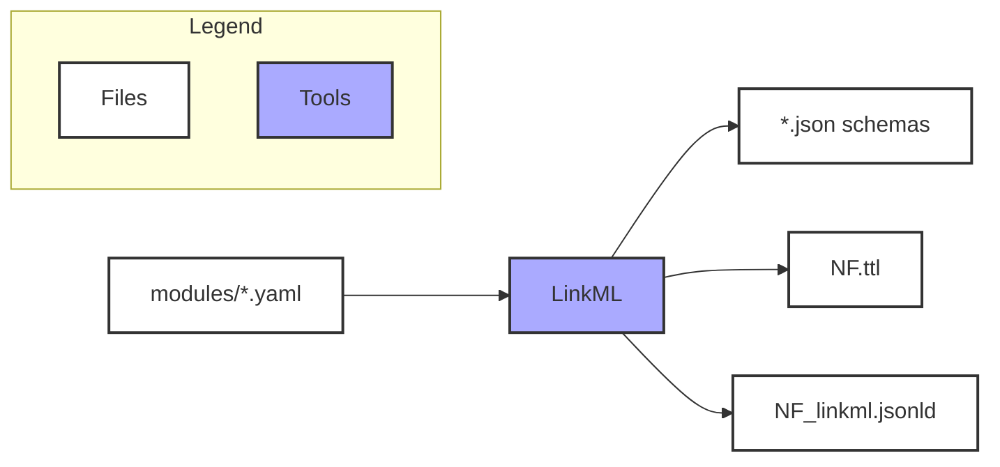

    

### Data Model Artifacts 

The data model is compiled and released as several different artifacts using various tooling. 
We keep the main one, `NF.jsonld`, in the root of the repository, while others are availble in `dist` and `registered-json-schemas` the folder.

#### A nice table summarizing what you might want to grab for different purposes

| Artifact | Description | Generated During PRs | Committed to PRs | Updated on Main | Registered to Synapse |
| -------- | ----------- | :------------------: | :--------------: | :-------------: | :-------------------: |
| `NF.jsonld` | **Legacy.** JSON-LD artifact for schematic compatibility. No longer updated as part of the build pipeline; kept for reference but might be removed later. | ❌ | ❌ | ❌ | N/A |
| `registered-json-schemas/*.json` | JSON serializations for a subset of the data model, for native functionality with Synapse platform or wherever a JSON definition is preferred. | ✅ (validated) | ❌ | ✅ (auto-committed) | ✅ (only on [release](https://github.com/nf-osi/nf-metadata-dictionary/blob/main/.github/workflows/release-new-version.yaml)) |
| `dist/NF.yaml` | Data model as as a single LinkML-valid YAML file, useful for using LinkML tooling to create Excel spreadsheets. | ✅ (validated) | ❌ | ✅ (auto-committed) | N/A |
| `dist/NF_linkml.jsonld` | JSON-LD from LinkML, best if you want to compare/combine our model with others maintained in LinkML, e.g. see here. There are differences with the `NF.jsonld`. | ✅ (validated) | ❌ | ✅ (auto-committed) | N/A |
| `dist/NF.ttl` | Basically same as above but in Turtle format. | ✅ (validated) | ❌ | ✅ (auto-committed) | N/A |

**Note:** All artifacts are built and validated during PRs but not committed to avoid merge conflicts. All artifacts are automatically rebuilt and committed to `main` after merge. **JSON schemas are only registered with Synapse during versioned releases** (see [release workflow](.github/workflows/release-new-version.yaml)).

In general, .jsonld or .ttl artifacts facilate model querying and comparison if you know how to load them into compatible linked data tooling. 

#### Details about the source/processing if you need to do more than just download something

- `modules/*.yaml`: Source files. Refer to [Data Model Framework](#data-model-framework) for editing guidelines.
- `Makefile`: Scripts to build the artifacts from the source files.
- Read docs/DEVELOPMENT.md



### Maintenance and Contribution

This data model, maintained by the NF-Open Science Initative, provides standard concepts and structure to help describe and manage data and other resources on the [NF Data Portal](nf.synapse.org). 

One can reference the data model to understand things such as:
- What type of entities there are (e.g. RNA-seq files vs image files, files vs datasets)
- What metadata properties exist for these different types, to help understand and use a data resource
- What are the preferred/standard labels for something as defined by community input and our data managers (e.g. prefer "NF2-related schwannomatosis" vs the now-deprecated "Neurofibromatosis type 2")

We welcome contributions from community members, whether you are a professional data modeler, researcher, or student in the NF community.

- For those familiar with editing code source files: Learn about the data model framework below, then edit the files directly in your preferred IDE.
- Alternatively: Create an [issue](https://github.com/nf-osi/nf-metadata-dictionary/issues) regarding terms, templates, or relationships.

#### Release Procedures

Releases create versioned JSON schemas registered with Synapse. The [release workflow](.github/workflows/release-new-version.yaml) can be triggered two ways:

1. **Push a tag**: `git tag v1.2.3 && git push --tags` — creates a GitHub release with versioned schemas
2. **Manual dispatch**: Run workflow from GitHub Actions UI with required `version` (e.g., `v1.2.3`) and optional `release_notes` input; when notes are omitted the workflow uses GitHub's auto-generated release notes

The workflow:
- Copies schemas from `registered-json-schemas/` to a temp directory
- Appends the version to each schema's `$id` (e.g., `org.synapse.nf-template` → `org.synapse.nf-template-1.2.3`)
- Registers versioned schemas with Synapse
- Creates/updates the GitHub release with a tarball of versioned schemas

Version format follows [semantic versioning](https://semver.org): `vMAJOR.MINOR.PATCH`

### Data Model Framework

The data model is maintained in **[LinkML](https://linkml.io/linkml/)**, a YAML-based modeling language, and compiled to **JSON Schema** for native validation on the Synapse platform.
This subset of LinkML should be easy to get started with.

#### The 10-minute Intro

The data model primarily models different types of biological data and patients/samples and uses templates that collects information for these entities. 
(It may helpful to also read about [Entity-Relation Model](https://en.wikipedia.org/wiki/Entity%E2%80%93relationship_model).)

To do this the building blocks are:

| LinkML term        | Note | Legacy Schematic Note |
| ------------------ | ---- |----------------------|
| Class              | Also known as "template" | Corresponds to "Component"; schematic used this to generate a "manifest" |
| Slot               | Also known as "property"; the range can be typical types (string, int, etc.) or enumerations (below) | Schematic called these "attributes" |
| Enum (enumeration) | Also known as "controlled values" | Schematic called these "valid values" |

Classes depend on slots being defined, and some slots depend on enumerated values being defined. 
If a class uses a slot that is not defined, the model will error when trying to build; and same with a slot that uses an enumeration.
Slots can be reused across classes; and same with enumerations for slot. 
For example, `unit` can be reused across any class entities that needs to capture unit information.

#### Classes

Classes have slots (properties). 
All classes are grouped under `modules/Template`. 
Classes can be built upon, so subclasses inherit properties from a parent class. 

##### Example: Base patient class

Here is an small-ish base class definition for a patient:

```
  PatientTemplate:
    is_a: Template
    description: >
      Template for collecting *minimal* individual-level patient data. 
    slots:
    - individualID
    - sex
    - age
    - ageUnit
    - species # should be constrained to human
    - diagnosis
    - nf1Genotype
    - nf2Genotype
    annotations:
      requiresComponent: ''
      required: false
```

#### Slots

Slots have a range, which can be a basic data type such as "string" and "integer", or a set of controlled values (see Enum). 
If the range of a slot is not explicit defined, it defaults to "string" (basically free text).
All slots are in the file `modules/props.yaml`. 

##### Example slots

```
slots:
  #...more above
  specimenType:
    description: Association with some tissue (a mereologically maximal collection of cells that together perform physiological function).
    range: SpecimenTypeEnum # Take a look at SpecimenTypeEnum below
    required: false
  title:
    description: Title of a resource.
    meaning: https://www.w3.org/TR/vocab-dcat-3/#Property:resource_title
    required: true
  # ...more below
```

Here, `required` defines globally whether this slot *must* be filled out. 
For example, `specimenID` is required, and is included for assay data class definitions that involve a specimen. 
For that reason, it is not included at all in individual-level assay data (e.g. behavioral/psychological data). 
Note: In situations where "the data meets the template", issues with a required slot might indicate that the template being used doesn't actually "fit" the type of data/entity, and an additional one needs to be defined.  

##### Validation rules

Validation constraints are expressed using native **LinkML rules** (preconditions/postconditions) and enforced at submission time via **JSON Schema** on the Synapse platform. See the [Conditional slot dependencies](#conditional-slot-dependencies-linkml-rules) section below for examples.

Some slots also carry legacy `requiresDependency` and `validationRules` annotations inherited from the schematic era:

```yaml
age:
    annotations:
      requiresDependency: ageUnit  # legacy schematic annotation
      validationRules: num         # legacy schematic annotation
    description: A numeric value representing age of the individual. Use with `ageUnit`.
    required: false
```

These annotations are retained for reference but are no longer the primary validation mechanism.

##### Conditional slot dependencies (LinkML rules)

Some slots require other slots to be present when they have values. These dependencies are now enforced using [LinkML rules](https://linkml.io/linkml/schemas/advanced.html) with preconditions and postconditions, in addition to the legacy `requiresDependency` annotations (which are maintained for backward compatibility with schematic).

**Example:** If `age` is provided, `ageUnit` must also be provided.

```yaml
BiologicalAssayDataTemplate:
  slots:
    - age
    - ageUnit
  rules:
    - description: If age is provided, ageUnit must be provided
      preconditions:
        slot_conditions:
          age:
            value_presence: PRESENT
      postconditions:
        slot_conditions:
          ageUnit:
            value_presence: PRESENT
```

**Note:** These rules are also represented as `requiresDependency` annotations in `modules/props.yaml`. These legacy annotations are retained until schematic-based tooling is fully deprecated and will be removed in a future cleanup.

#### Enum

An enumeration is a set of controlled values. 
Enums are most of the files `modules`, everything except for what's in `Templates` and `props.yaml`.

##### Example: SpecimenType enumeration

```
enums:
  SpecimenTypeEnum:
    permissible_values:
      cerebral cortex:
        description: The outer layer of the cerebrum composed of neurons and unmyelinated nerve fibers. It is responsible for memory, attention, consciousness and other higher levels of mental function.
        meaning: http://purl.obolibrary.org/obo/NCIT_C12443
      bone marrow:
        description: The soft, fatty, vascular tissue that fills most bone cavities and is the source of red blood cells and many white blood cells.
        meaning: http://purl.obolibrary.org/obo/BTO_0000141
     #...more below
```


##### Example: Boolean enumeration (commonly reused) 

```
enums:
  BooleanEnum: 
    description: 'Boolean values as Yes/No enums'
    permissible_values:
      'Yes':
        description: 'True'
      'No':
        description: 'False'
```

#### General meta to describe classes, slots, and enums

Aside from meta specific to each type (class, slot, or enum) above, terms have common meta, where the most prominent are summarized here:

- `description`: Description to help understand the term.
- `meaning`: This is a highly recommended and should be an **ontology URI that the term maps to**.
- `source`: This can be used to supplement `meaning`, but it's most often used when an ontology URI does not exist.
  It provides a reference such as a publication. For example, a very novel assay might not have a real ontology concept yet but will likely be described in a paper.
- `notes`: Internal editor notes.


### Steps to contribute to the Metadata Dictionary: 

1. Create a new [branch](https://github.com/nf-osi/nf-metadata-dictionary/branches) in the NF-metadata-dictionary repository. (example: `patch/add-attribute`)
2. Find the yaml file in the new branch where the attribute belongs. The components of the data model are organized in the folder labeled [modules](https://github.com/nf-osi/nf-metadata-dictionary/tree/main/modules).

3. Create a [pull request (PR)](https://github.com/nf-osi/nf-metadata-dictionary/compare) to merge the branch to "main". Someone from https://github.com/orgs/nf-osi/teams/dcc-team will review. Creating the PR will:
   i. Build and validate all artifacts (JSON schemas, LinkML outputs, etc.) from the module source files.
   **Artifacts are not committed to the PR to avoid merge conflicts, but will be automatically rebuilt and committed to main after merge.**

   ii. Run tests to make sure all looks good/generate previews. After some minutes, test reports will appear in the PR including artifact build status, schema validation, and test results. Note: Trivial changes can skip tests by labeling the PR with https://github.com/nf-osi/nf-metadata-dictionary/labels/skip%20tests.

4. The reviewer might suggest changes, otherwise the changes are approved and the reviewer will merge into `main`. 

5. You should see the update [in the docs](https://nf-osi.github.io/nf-metadata-dictionary) after merge, but *versioned* data model releases happen approximately at beginning and middle of the month; contributions should be mentioned in the release notes of the next release.


### Further Information

#### Building Locally
To build locally you need [LinkML](https://linkml.io/linkml/), `make`, `yq`, and `jq`. See [DEVELOPMENT.md](DEVELOPMENT.md) for setup details.

#### Testing

See [DEVELOPMENT.md](DEVELOPMENT.md#local-testing) for how to run tests and add new test cases.

#### Help

For questions or to get help contributing a term, [please create an issue](https://github.com/nf-osi/nf-metadata-dictionary/issues).

#### License

The "collection" of metadata terms in this repository is made available under a CC0 license. The individual terms and their definitions may be subject to other (permissive) licenses, please see the source for each metadata term for details. 
