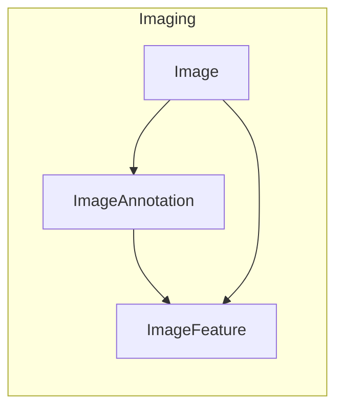
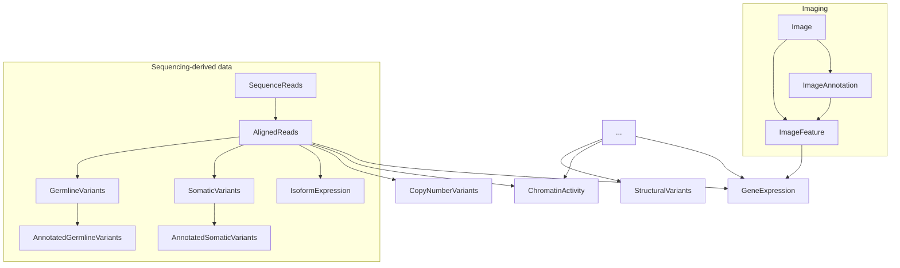
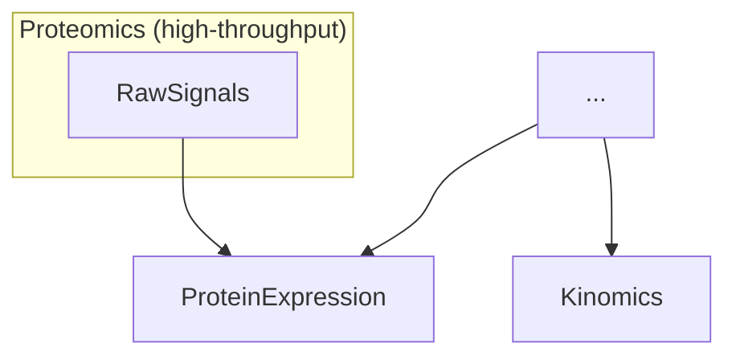
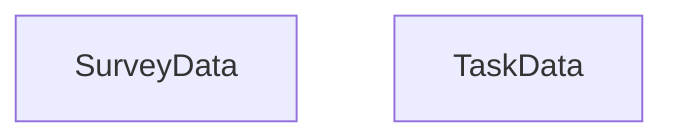

## Data types

This explains the relationship between concepts of `dataType`, `dataSubtype` (also seen in the Sage Bionetworks AD model), and "Level" (also seen in the Genomic Data Commons or HTAN model). 

The most straightforward example of the relationships is seen in the table below for genomics data:

| dataType        | dataSubtype    | Level         |  |
| -------------   | -------------  | ------------- | ------------- |
| geneExpression  | raw            | 1  | historically, data uploaded should be raw, so this legacy term mostly means unprocessed fastq but can be semantically confusing because it could be applied to more processed data as well (the term is fuzzier, has broad coverage)  |
| AlignedReads    | semi-processed | 2  | e.g. bams  |
| SomaticVariants | processed      | 3  | e.g. vcf   |
| AnnotatedSomaticVariants / AggregatedSomaticVariants | processed  | 4     | e.g. maf |

Data type can contain some information about the possible assay modality + how processed the data is. Note that at the more processed levels, we can get less information about the assay that generated the data. That is, AlignedReads has to come from some sort of sequencing assay, but it is possible to get SomaticVariants from a non-sequencing technique such as optical genome mapping -- there are other possible paths to get to the same type of information. 

The `dataSubtype` values "raw", "processed", etc. can absolutely be derived from `dataSubtype` using known relationships. "Level" appears to be another system that provides somewhat more granular and understandable number-based labels for how derived or processed the data type is. 

These relationships should be viewed as a graph, such as the [GDC one](https://gdc.cancer.gov/developers/gdc-data-model). **Unfortunately, working out the terminology and relationships can be more difficult with other data types.**

The diagrams below show some examples. A lower-placed entity B with an arrow from A should be read as "B can be processed/derived from A". 

The solid vs. dashed border around nodes indicates whether data is "required" vs. "optional" for contribution.

## Image Data

Image data is one of the most important data contributed.
Image annotation inlude Regions of Interest (ROI), image masks.
Image features can be derived from the image annotation (e.g. class counts for ROIs) or from the image directly (e.g. pixel intensities).

## DNA/RNA Data

DNA/RNA data usually focuses on that generated by high-throughput methods, e.g. sequencing provides a lot of quantified gene expression data.
However, there can be quantified gene expression from other low-throughput methods (denoted by the `[...]` node).
In some cases, quantified gene expression data *is also* image feature data, such as in an assay such as FiSH. 

## Protein Data

Most protein data come from mass spectometry assays.
Kinomics is a data subset of quantitfied prptein expression, i.e. focused on kinases.

## Behavioral/Cognitive Data

  
