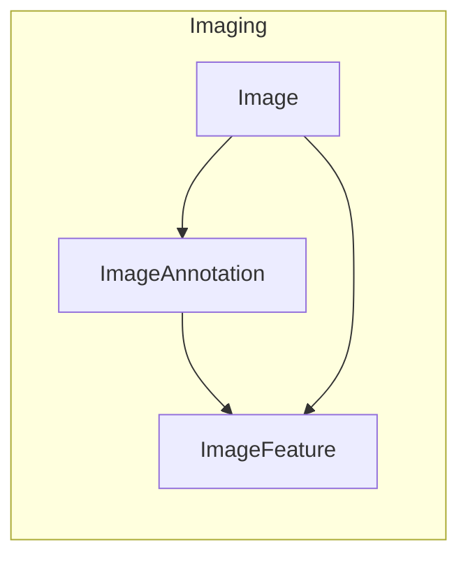
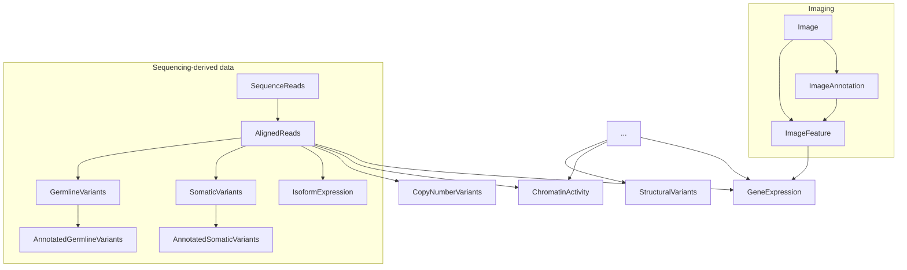
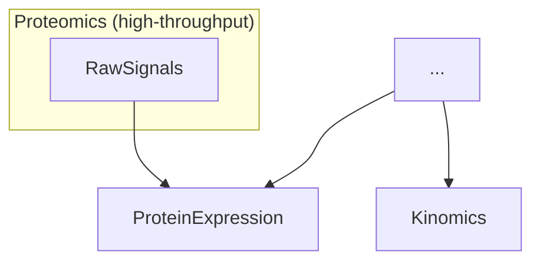
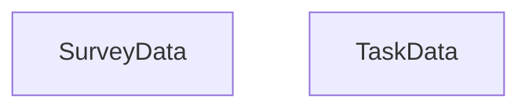

## Data types

This document conceptualizes how data types are conceptualized in the data model. 
The main relationship here is the derivation relationship, which helps to show whether data is relatively "raw" vs. "processed". 
In looking at the diagrams below, a lower-placed entity B with an arrow from A can be read as "B can be processed/derived from A". 

The solid vs. dashed border around nodes indicates whether data is "required" vs. "optional" for contribution.

## Image Data

Image data is one of the most important data contributed.
Image annotation inlude Regions of Interest (ROI), image masks.
Image features can be derived from the image annotation (e.g. class counts for ROIs) or from the image directly (e.g. pixel intensities).

## DNA/RNA Data

DNA/RNA data usually focuses on that generated by high-throughput methods, e.g. sequencing provides a lot of quantified gene expression data.
However, there can be quantified gene expression from other low-throughput methods (denoted by the `[...]` node).
In some cases, quantified gene expression data *is also* image feature data, such as in an assay such as FiSH. 

## Protein Data

Most protein data come from mass spectometry assays.
Kinomics is a data subset of quantitfied prptein expression, i.e. focused on kinases.

## Behavioral/Cognitive Data

  
